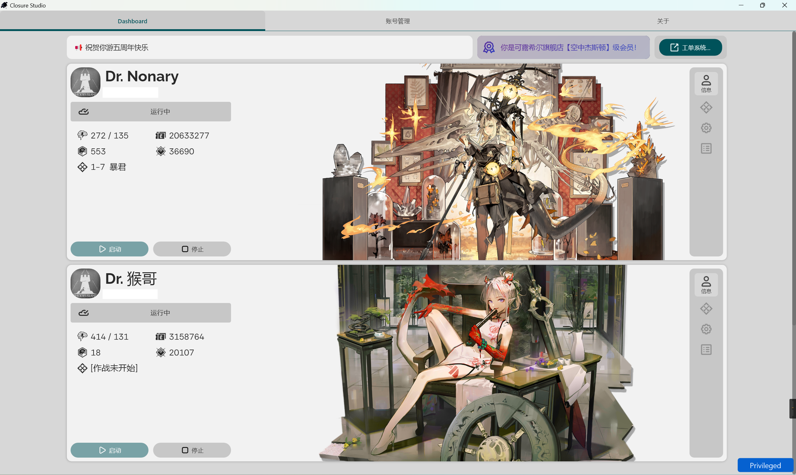
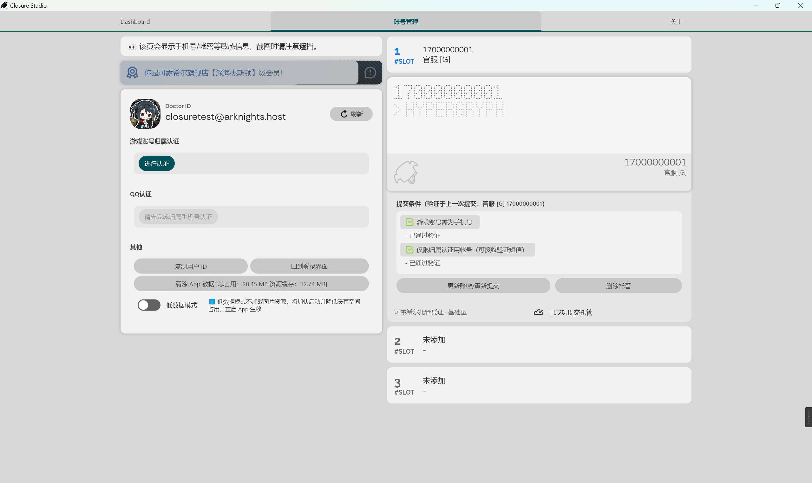

# Arkhost-UI-Slint
可露希尔轻量级桌面客户端-D32钢

基于 [Slint](https://slint.dev/) 框架开发

## Showcase



## Features
- [X] 抽卡出货公告
- [X] SSE长连接
- [ ] UI内错误提示
- [X] 修改作战列表+作战关卡显示
- [ ] 统计功能（理智，收益…）
- [X] 查看作战截图
- [X] 增删账号/修改密码
- [X] 验证手机/QQ/新注册账号使用指导
- [X] 公告等平台信息
- [ ] 开机自启/最小化到托盘
- [X] 桌面消息通知（部分已实现）
- [X] OTA更新（完整+增量更新）

### 需要依赖后端实现的功能
- [ ] 下次登录时间
- [ ] 统计相关功能

## Build

### Windows
在构建 Windows 桌面端时需要通过 Feature Flag 选择一个渲染器：
```powershell
# Skia（首选）
cargo build -F "desktop-app,renderer-skia"
# FemtoVG
cargo build -F "desktop-app,renderer-femtovg"
```

如果选择了 Skia 渲染器（`renderer-skia`），由于默认的 [skia-binaries](https://github.com/rust-skia/skia-binaries)
没有提供 `+crt-static` 的Skia预编译二进制文件，需要在构建时设置以下环境变量：
```powershell
$env:SKIA_BINARIES_URL = "https://github.com/wg138940/skia-binaries/releases/download/{tag}/skia-binaries-{key}.tar.gz"
```

### Android
安卓目前使用 `xbuild` 进行跨平台编译：
```sh
# 安装 xbuild 和编译目标
cargo install xbuild
rustup target add aarch64-linux-android
# 或者 x86_64
rustup target add x86_64-linux-android

# 安装 JDK 和安卓 SDK（略）

# 设置安卓跨平台编译工具链，例如：
export ANDROID_HOME="~/Android/Sdk"
export ANDROID_NDK_ROOT="~/Android/Sdk/ndk/26.2.11394342"

# 添加 NDK bin 目录到 PATH 环境变量
export PATH=/home/closure/Android/Sdk/ndk/26.2.11394342/toolchains/llvm/prebuilt/linux-x86_64/bin/:$PATH

# 检查 xbuild 状态，确认 xbuild 找到了 clang/llvm 工具链、Java
x doctor

# 输出例
: '
--------------------clang/llvm toolchain--------------------
clang                +pgo,               /home/closure/Android/Sdk/ndk/26.2.11394342/toolchains/llvm/prebuilt/linux-x86_64/bin/clang
clang++              +pgo,               /home/closure/Android/Sdk/ndk/26.2.11394342/toolchains/llvm/prebuilt/linux-x86_64/bin/clang++
llvm-ar              unknown             /home/closure/Android/Sdk/ndk/26.2.11394342/toolchains/llvm/prebuilt/linux-x86_64/bin/llvm-ar
llvm-lib             unknown             /home/closure/Android/Sdk/ndk/26.2.11394342/toolchains/llvm/prebuilt/linux-x86_64/bin/llvm-lib
llvm-readobj         17.0.2              /home/closure/Android/Sdk/ndk/26.2.11394342/toolchains/llvm/prebuilt/linux-x86_64/bin/llvm-readobj
lld                  17.0.2              /home/closure/Android/Sdk/ndk/26.2.11394342/toolchains/llvm/prebuilt/linux-x86_64/bin/lld
lld-link             17.0.2              /home/closure/Android/Sdk/ndk/26.2.11394342/toolchains/llvm/prebuilt/linux-x86_64/bin/lld-link
lldb                 17.0.2              /home/closure/Android/Sdk/ndk/26.2.11394342/toolchains/llvm/prebuilt/linux-x86_64/bin/lldb
lldb-server          not found

----------------------------rust----------------------------
rustup               1.27.0              /home/closure/.cargo/bin/rustup
cargo                1.77.0              /home/closure/.cargo/bin/cargo

--------------------------android---------------------------
adb                  not found
javac                11.0.22             /usr/bin/javac
java                 11.0.22             /usr/bin/java
kotlin               not found
gradle               not found

----------------------------ios-----------------------------
idevice_id           not found
ideviceinfo          not found
ideviceinstaller     not found
ideviceimagemounter  not found
idevicedebug         not found
idevicedebugserverproxy not found

---------------------------linux----------------------------
mksquashfs           4.5                 /usr/bin/mksquashfs
'

# 构建 APK (aarch64 debug)
x build --arch arm64 --platform android -p arkhost-ui-slint -F "android-app" --offline --format apk
# 或者 release
x build --arch arm64 --platform android -p arkhost-ui-slint -F "android-app" --offline --format apk -r
```

## About
本项目是我学习 Rust 和 Slint UI 框架的一部分。

## Contribution
欢迎对本项目提出 Feature 或改进代码质量相关的贡献。
